#  *STM32*   : `HAL` 库 `GPIO_WritePin` 点亮LED灯
---
## 一、 `CubeMX`  配置步骤
---

  __我们这个文档主要是讲述如何利用蓝桥杯提供的 ` STM32G431RBT6 `  进行我们的基本操作的实现，下面是我们的详细讲述：__  
>1.	先打开 **CubeMX**  进行型号的选择:

>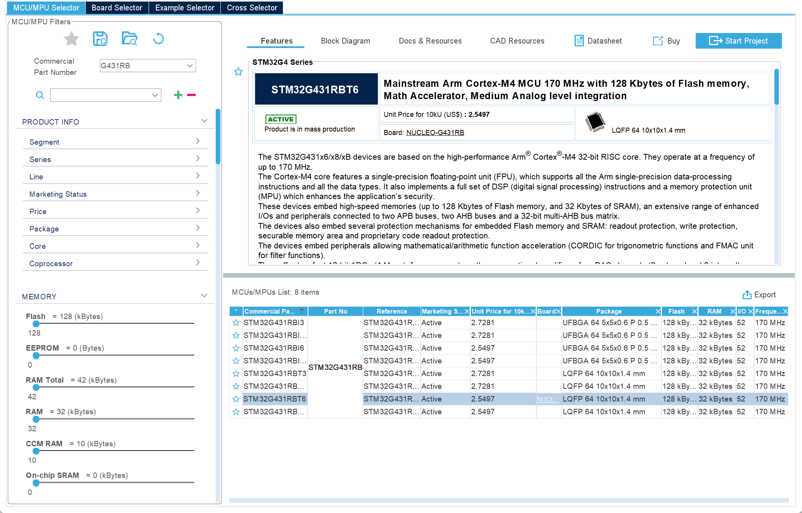


>	我们这里选择 `STM32G431RBT6` 版本，这里是我们蓝桥杯的标准MCU


>2. MCU的 **基本引脚** 设置:
>
>	  这一步需要根据比赛或者自己的板子原理图查看需要设置哪几个端口为LED要用到的GPIO_OUTPUT，这块板子要用到的是PC8~PC15与PD2（锁存器）的端口
>	 

>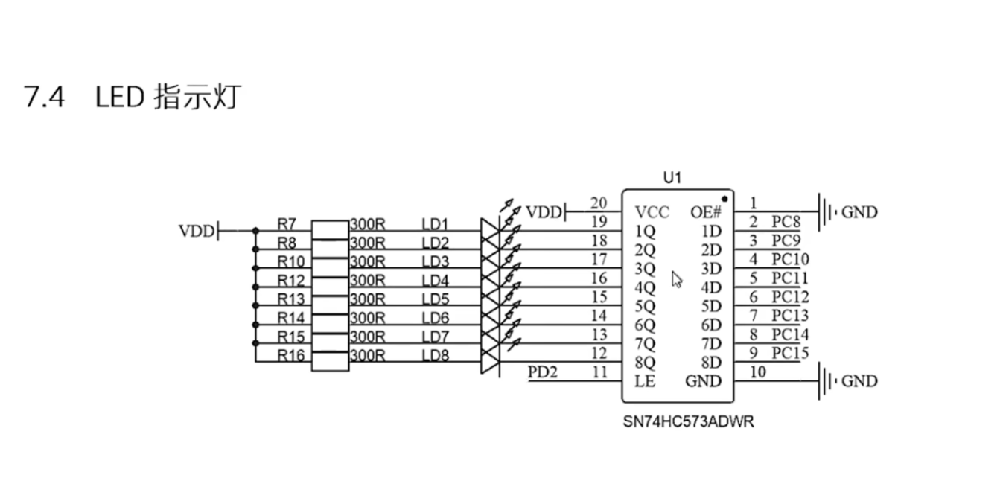

>	  我们在这里先来设置我们的 高速时钟(HSE) 是打开的状态，选择晶振（Crystal）
>
>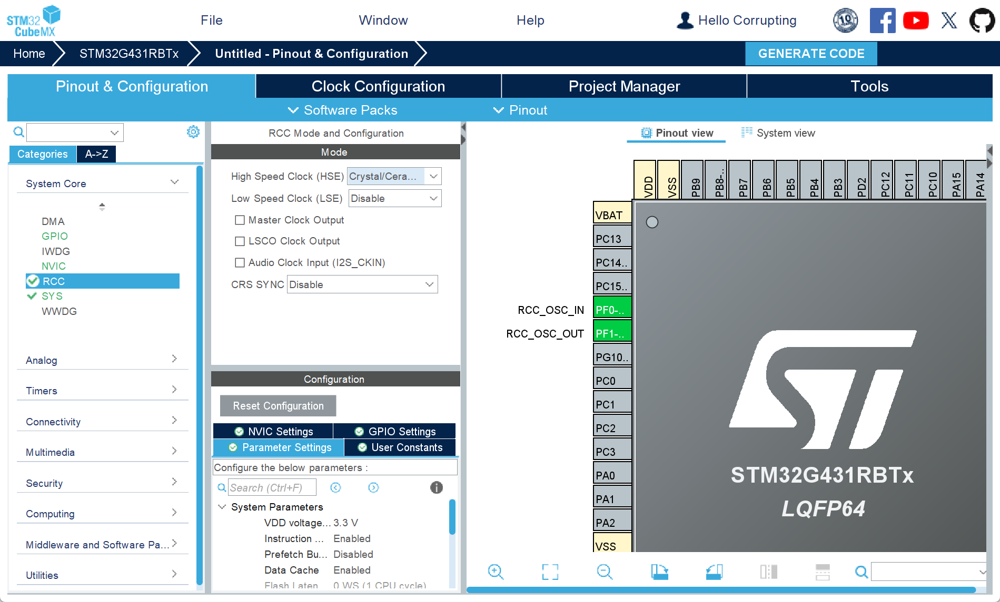
>
>	接下来设置 Debug 为: `serial wire` 


>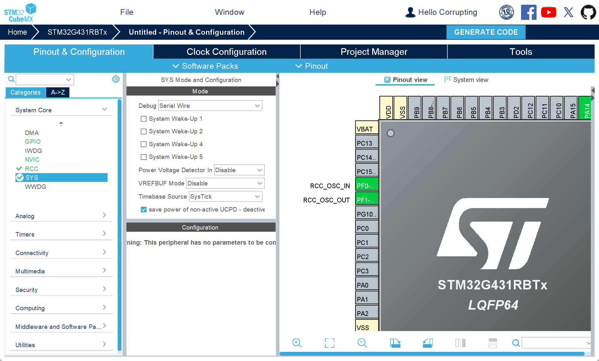

>	接下来我们调整时钟设置，调整参数均已经标注好:
> 

>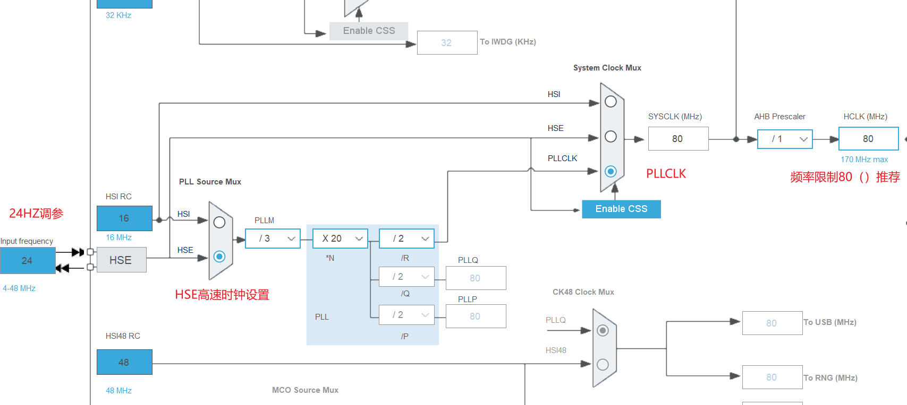
>
>	接下来是工程名称和编译器的设置:

>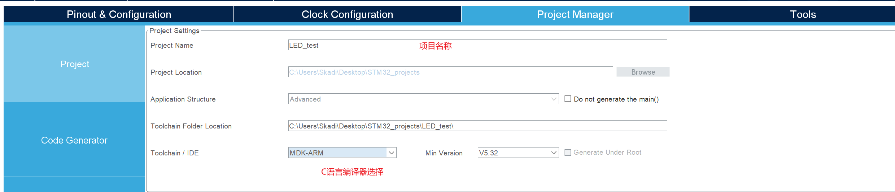
>
>	勾选下面的这项：

>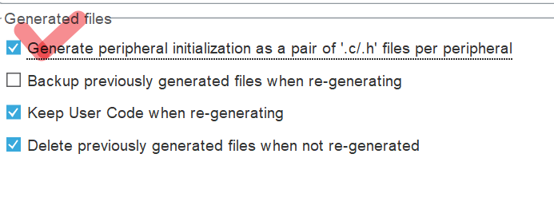
>

---

## 二、ARM-Keil的代码编写与配置

>	首先，在工程目录下新建一个dsp文件夹存放我们自己写的代码文件（.h/.c）文件
>	

>```c
>// 定义LED.h头文件
>#ifndef _LED_H_
>#define _LED_H_
>void showLEDS(unsigned char show);
>#endif 
>```
>

>```c
>//定义LED.c函数
># include "led.h"
># include <main.h>
>void showLEDS(unsigned char show)
>{
>		HAL_GPIO_WritePin(GPIOC , GPIO_PIN_All, GPIO_PIN_SET);
>		HAL_GPIO_WritePin(GPIOC , show << 8, GPIO_PIN_RESET);
>		HAL_GPIO_WritePin(GPIOD , GPIO_PIN_2, GPIO_PIN_SET);
>		HAL_GPIO_WritePin(GPIOD , GPIO_PIN_2, GPIO_PIN_RESET);
>
>}
>
>```

 **这里我要强调一个很重要的事情**  就是我们的自己写的库文件和头文件不能跟大写字母，不然会找不到我们的文件，并且要在调试的时候把 `dsp` 文件夹添加到工程文件的 `#include path` 当中，不然keil会报错，找不到你写的路径。

>```c
>// main.c文件要添加你自己写的led.h头文件
>/* USER CODE END Header */
>/* Includes ----------------------------------------------------------->-------*/
>#include "main.h"
>#include "gpio.h"
>
>/* Private includes --------------------------------------------------->-------*/
>/* USER CODE BEGIN Includes */
>#include "led.h"
>/* USER CODE END Includes */
>
>```
>

>```c
>// 在GPIO端口的初始化不要忘记（由于在高电平下熄灭，所以传入0x00进行熄灭）
> MX_GPIO_Init();
>/* USER CODE BEGIN 2 */
>		showLEDS(0x00);
> /* USER CODE END 2 */
>/* USER CODE BEGIN WHILE */
> while (1)
>  {
>    /* USER CODE END WHILE */
>			showLEDS(0x01);
>			HAL_Delay(500);
>			showLEDS(0x02);
>			HAL_Delay(500);
>			showLEDS(0x04);
>			HAL_Delay(500);
>   /* USER CODE BEGIN 3 */
>  }
> /* USER CODE END 3 */
>
>```
>
***至此，我们已经可以实现在 `STM32G431RBT6` MCU的跑马灯效果了***

---

## 三、LCD的使用

> 我们在上文中已经实现了跑马灯的效果，现在，我们实现LCD显示的功能
> 	1. 从官方添加  `lcd.h` 与 `lcd.c` 和 `fonts` 字体文件添加到项目当中
> 	2. 根据官方提供的原理图设置引脚：

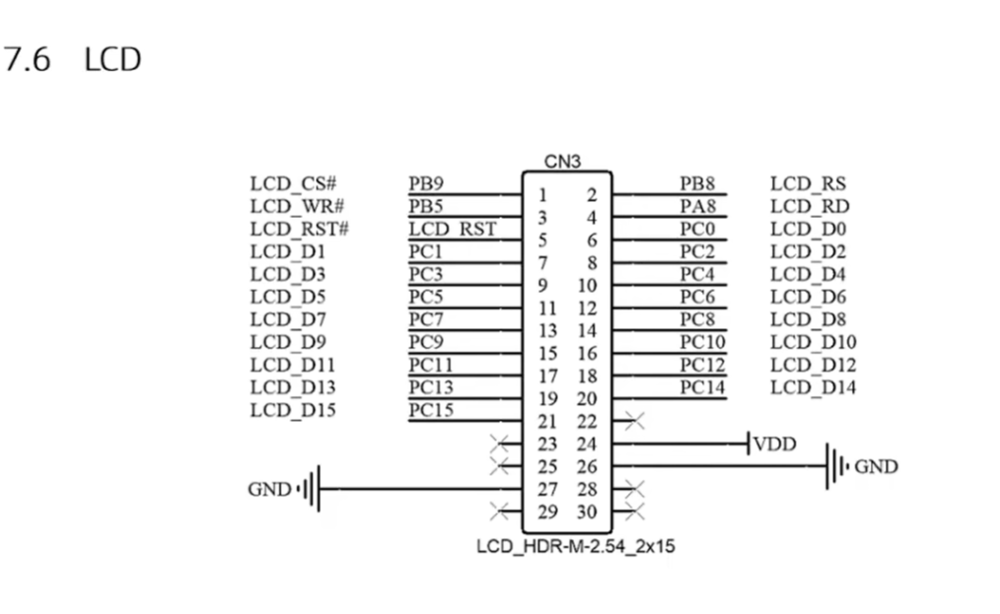


> 设置完成之后我们当中 `MX_GPIO_Init` 当中初始化我们的 `LCD` 屏幕
> ```c
>/* Initialize all configured peripherals */
>  MX_GPIO_Init();
>  /* USER CODE BEGIN 2 */										
>		LCD_Init();																	// Initialize LCD
>		LCD_Clear(Black);															// 清屏
>		LCD_SetBackColor(Black);													// 设置背景色是黑色
>		LCD_SetTextColor(White);													// 设置文本颜色是白色
>		 
> /* USER CODE END 2 */ 
> ```

>  **注意，在这里的我们需要在头文件引入 `stdio.h`  以便调用 `sprintf` 函数**  
>
>  ```c
>  /* USER CODE BEGIN WHILE */
>  while (1)
>  {
>  /* USER CODE END WHILE */
>  			char text[30];											// >Define a char martrix
>  			char data1[30]; 
>  			unsigned int CNBR = 2; 
>  			sprintf(text, "--------Data");							// >Print the text into martrix
>  			sprintf(data1,"--CNBR:%d", CNBR);
>  			LCD_DisplayStringLine(Line1, (unsigned char *)text);
>  			LCD_DisplayStringLine(Line3, (unsigned char *)data1);
>  /* USER CODE BEGIN 3 */
>  }
>  ```
>  

> **调用LCD进行打印需要先定义一个字符数组然后将我们想要打印的字符串传入其中**
> **随后使用 `LCD_DisplayStringLine(Linen, (unsigned char *)(unsigned char 类型的数据容器))` **

---
## 四、Key按键的使用（定时器的使用）


> 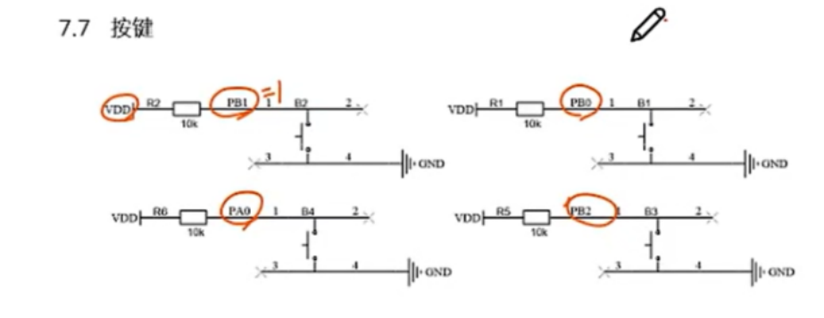
> 

>		首先，老生常谈，我们根据 `单片机原理图` 进行CubeMX的配置:
>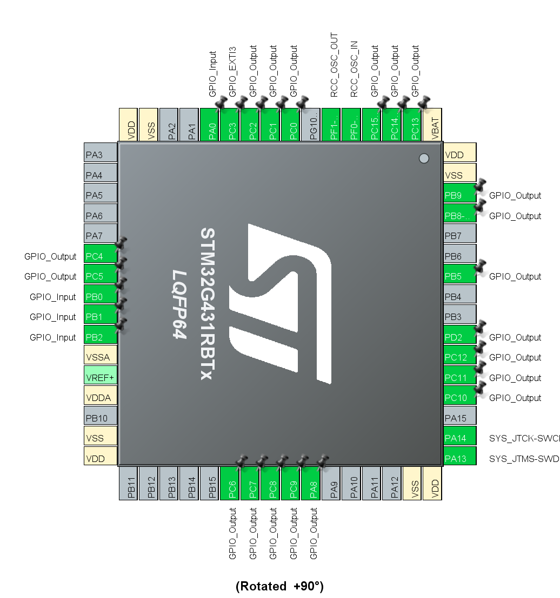	
>
>		随后，我们选中刚才设置的几个端口并且在CubeMX的设置当中选择上拉，如上图所示：

>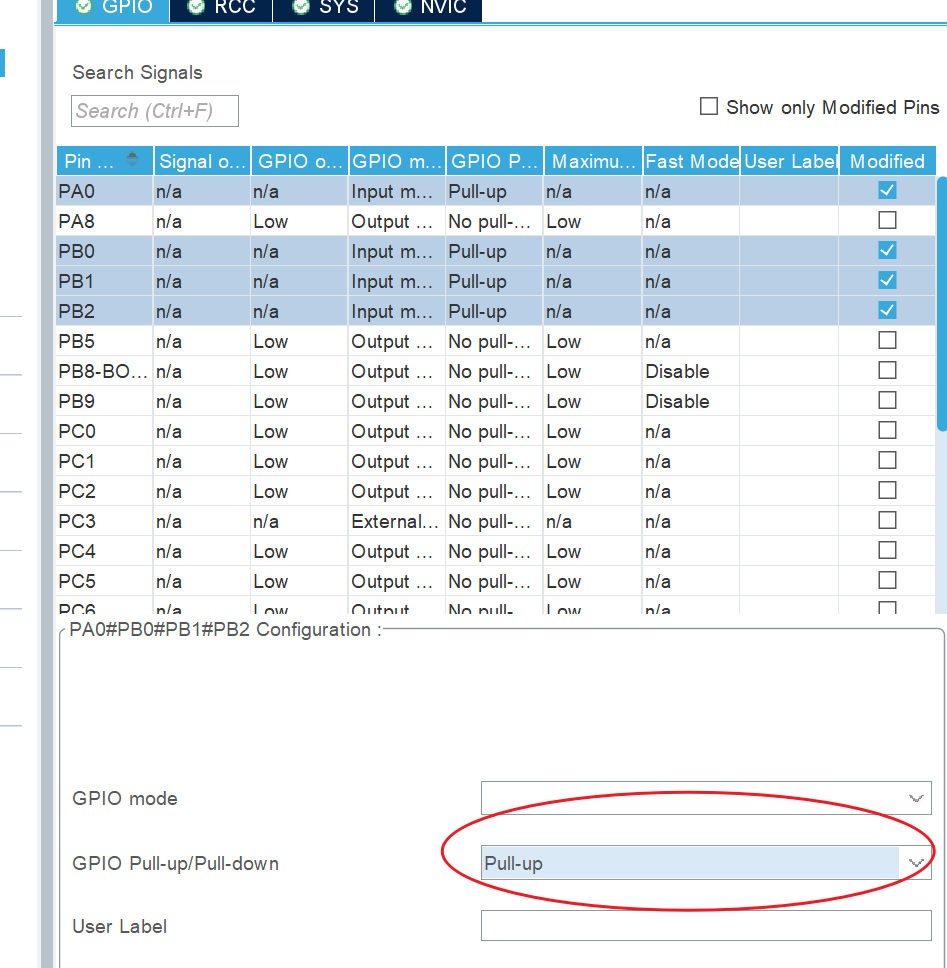
>

>	接下来我们要进行时钟信号的配置(任选一个TIM，设置clocksorce为内部Internal Clock)(工作频率设置为1MHZ)，所以PSC = (80/1) - 1,所以我们在这里设置我们的PSC为79，定时频率=外部总线频率/(PSC+1)* counter 
>	
>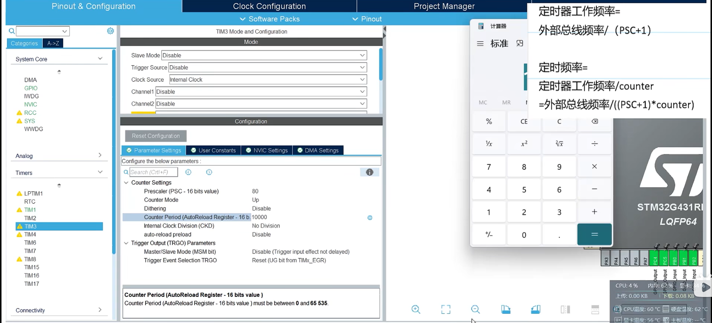
>

>	然后我们在NVIC当中设置中断
>	

>	勾选enabled,然后点击Generate Code 生成代码

```c
	// 在这里我们定义我们的interrupt头文件来使用时钟定时进行端口扫描
	# ifndef _INTERRUPT_H_
	# define _INTERRUPT_H_
	# include "main.h"
	# include "stdbool.h"
	struct keys{
		unsigned judge_status;
		bool key_status;
		bool signal_flag;
	};
	void HAL_TIM_PeriodElapsedCallback(TIM_HandleTypeDef *htim);
	#endif


```

```c
// 我们在这里定义我们的interrupt.c文件，主要目的就是判断哪个端口被按下以及消抖，注意这里的函数名称是固定的
# include "interrupt.h"
struct keys key[4] = {0, 0, 0};												// Initialize the struct																
void HAL_TIM_PeriodElapsedCallback(TIM_HandleTypeDef *htim)					// HAL_TIM_PeriodElapsedCallback
{
	if(htim->Instance == TIM3){																				// To figure out wheather it's from TIM3
			key[0].key_status = HAL_GPIO_ReadPin(GPIOB, GPIO_PIN_0);			// Read the value of GPIOB_0
		  key[1].key_status = HAL_GPIO_ReadPin(GPIOB, GPIO_PIN_1);	
	    key[2].key_status = HAL_GPIO_ReadPin(GPIOB, GPIO_PIN_2);	
			key[3].key_status = HAL_GPIO_ReadPin(GPIOA, GPIO_PIN_0);	
		
		  for(int i=0; i < 4; i++)																			// The code here is meant to eliminate the false movement
		{
				switch(key[i].judge_status){
				
					case 0:{
						if(key[i].key_status == 0)															 // we have four keys to detect
							key[i].judge_status = 1;															 // if we figure that the key is clicked
					}
					break;
					case 1:{
						if(key[i].key_status == 0)															 // we have four keys to detect
							key[i].judge_status = 2;															 // if we figure that the key is clicked
							key[i].signal_flag = 1;
					}
					break;
					case 2:{
						if(key[i].key_status == 1)
						{
							key[i].judge_status = 0;															 // rejudge the clicked circumstance
						}
				}
					break;
		}
	}
}
	}
```

```c
 /* USER CODE BEGIN WHILE */
  while (1)
  {
    /* USER CODE END WHILE */
			char text[30];
			if(key[0].signal_flag == 1)
			{
					sprintf(text,"key0downed~");
					LCD_DisplayStringLine(Line9, (unsigned char *)text);
					key[0].signal_flag = 0;
			}
			if(key[1].signal_flag == 1)
			{
					sprintf(text,"key1downed~");
					LCD_DisplayStringLine(Line9, (unsigned char *)text);
					key[1].signal_flag = 0;
			}
			/*else{
					LCD_DisplayStringLine(Line9, (unsigned char *)"Waiting for orders!");
					HAL_Delay(1000);
					LCD_ClearLine(Line9);
			}*/
    /* USER CODE BEGIN 3 */
```

	至此，我们已经可以实现按键的检测与消抖
---
 ## 五、按键的长按检测
 

